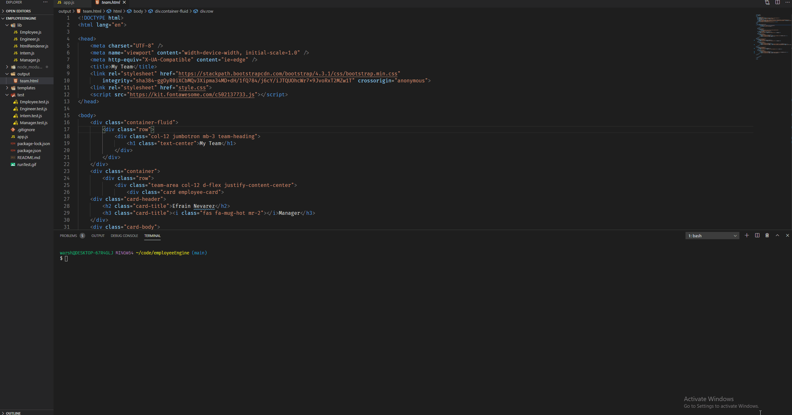

# Empire Generator
 

 
### Table of Contents:
* [User Story](##-User-Story)
* [Description](##-Description)
* [Installation](##-Installation)
* [Credits](##-Credits)
* [Contributors](##-Contributors)
* [License](##-License)
 
## Deployed site
[Empire Generator](https://enevarez-ops.github.io/employeeEngine/)

 
## User Story
This site will be used to generate a template of a company team.
 
## Description
Uses node and javascript to generate a team for a company.
 
## Installation
Install dependencies and run on node. 
 
## Contributors
Efrain Nevarez
 
## Credits
HTML, JavScript, Node
 
## License
This project is licensed by MIT